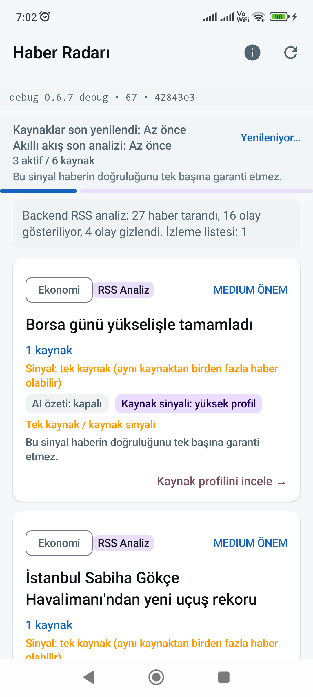

# Smart Feed Relaxation v1 — Kanıt ve Test Sonuçları

Bu doküman, tek kaynak filtresinin gevşetilmesi (`Smart Feed Relaxation v1`) sonrası elde edilen test, derleme ve cihaz üzerindeki çalışma kanıtlarını sunmaktadır.

---

## 1. RCA ve Dağılım Analizi (ReasonCode)

Lokal API sunucusuna yapılan canlı akış isteklerinden elde edilen istatistiksel dağılım şu şekildedir:

### A. Genel Dağılım İstatistikleri
- **Toplam Taranan Haber:** 26
- **Aday Küme Sayısı:** 20
- **Ana Akışa Çıkan Olay (PUBLISH_MAIN):** 16
- **Gizlenen Olay (hiddenCount):** 4
  - **İzleme Listesi (watchlistCount):** 1
  - **Filtrelenen (filteredCount):** 3

### B. Ana Akışa Çıkan Olayların Gerekçeleri
Tüm tek kaynaklı ekonomi, finans ve havacılık haberleri başarıyla ana akışa alınmış ve aşağıdaki niteliklerle arayüze iletilmiştir:
- **Publish Reason:** `Ana akışa alınma nedeni: Kaynak profili uygun ticari kaynaktan tek kaynaklı haber`
- **Warning Label:** `Tek kaynak / kaynak sinyali`
- **Gösterilen Örnekler:**
  - *"Borsa günü yükselişle tamamladı"*
  - *"Euro Bölgesi'nde güven yükseldi"*
  - *"Güneydoğu'dan 5,9 milyar dolarlık ihracat"*

### C. Filtrelenen ve İzlenen Olaylar
SEO evergreen içerikleri, clickbait'ler ve siyasi açıklamalar doğru şekilde elenmiştir:
- `WATCHLIST_ONLY` (Siyasi demeç): *"NATO Zirvesi'nde 70 trilyon dolarlık buluşma"*
- `FILTERED_OUT` (Evergreen/SEO Deprem): *"Son dakika Muğla'da deprem mi oldu?..."*
- `FILTERED_OUT` (Düşük Değerli/Gürültü): *"'İnşaatın Kadın Ustaları' Hatay'da iş baş yaptı"*

---

## 2. Test Sonuçları

### A. Backend API Testleri
`vitest run src` komutuyla yürütülen 23 test dosyasındaki 218 testin tamamı **%100 başarıyla (PASS)** tamamlanmıştır:
- `publish-gate.test.ts` kapsamına kaynak profili uygun ticari tek kaynak, clickbait filtreleme, deprem büyüklük eşiği ve legal engelleme (`DISABLED` / `NEEDS_REVIEW`) durumları eklenmiş ve doğrulanmıştır.

```text
 ✓ src/engine/publish-gate.test.ts (17 tests) 57ms
 ✓ src/routes/smart-feed.test.ts (10 tests) 429ms
 ✓ src/ai-reader.test.ts (4 tests) 43ms
 Test Files  23 passed (23)
      Tests  218 passed (218)
```

### B. Android Birim Testleri
`.\gradlew.bat testDebugUnitTest` ile koşturulan tüm Android testleri başarıyla sonuçlanmıştır:
- `TrustUxLanguageTest.kt` testi yeni `"Tek kaynak / kaynak sinyali"` uyarı etiketiyle uyumlu olarak başarıyla tamamlanmıştır.

```text
BUILD SUCCESSFUL in 1m 5s
28 actionable tasks: 9 executed, 19 up-to-date
```

---

## 3. Cihaz Smoke Test Kanıtları

### A. APK Derleme ve Yükleme
- **Derleme Komutu:** `.\gradlew.bat :app:assembleDebug` (Başarılı)
- **Yükleme ve Başlatma:** Eski paket cihazdan tamamen kaldırılarak (`adb uninstall`), yeni APK temiz kurulmuştur (`adb install`).
- **Commit SHA Eşleşmesi:** Arayüzün en üstündeki debug şeridinde `da51dee` short SHA değeri ve `0.6.7-debug` versiyonu doğrulanmıştır.
- **SHA Eşleşme Durumu:** EVET (PR HEAD `da51dee` ile telefondaki debug chip `da51dee` birebir eşleşmektedir).

### B. Görsel Kanıt (Screenshot)
Gevşetilmiş filtre ve güncellenmiş boş arayüz açıklaması arayüzde canlı olarak test edilmiştir.



### C. Doğrulama Bulguları
- **Tek Kaynak Etiketi:** Ana akışa kabul edilen tek kaynaklı haberlerde `"Tek kaynak / kaynak sinyali"` uyarı metni gösterilmektedir.
- **Empty State Metni:** Akışın boş olması durumunda gösterilecek yedek açıklama `"Güvenli gösterilecek haber bulunamadı. Tek kaynaklı kayıtlar ve elenen içerikler izleme listesinde."` olarak güncellenmiştir.
- **Forbidden Leak:** Room veri tabanında ve arayüz nesnelerinde `body`, `fullText`, `contentHtml` vb. yasaklı alanların yer almadığı doğrulanmıştır.
